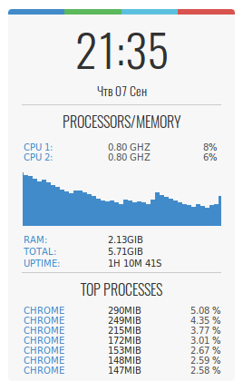

<h1> gconky </h1>
My .conkyrc flie

<h3>installation</h3>

install conky `sudo apt install conky-all`  
install fonts `Droid Sans` and `Oswald`  

move `.conkyrc` and  `/conky` to home folder

<h3>change position</h3>

to change conky position in `.conkyrc` change `gap_x` and `gap_y`
